# Avatar Data Generator - Pipeline Documentation

## Complete Generation Pipeline Flow

```mermaid
graph TD
    A[User: POST /generate] --> B[Flask App: app.py]
    B --> C[Create GenerationTask]
    C --> D[(PostgreSQL Database)]
    D --> E{APScheduler<br/>Background Worker}

    E --> F[task_processor.py<br/>process_single_task]

    %% Data Generation Phase
    F --> G{Get Pending Task<br/>with Lock}
    G --> H[Status: pending → generating-data]
    H --> I[Flowise API<br/>Persona Data Generation]

    I --> J[Generate Person Details:<br/>firstname, lastname, gender<br/>bio_facebook, bio_instagram<br/>ethnicity, age]

    J --> K[(Store in generation_results)]
    K --> L[Status: generating-data → data-generated]

    %% Image Generation Phase
    L --> M{Get data-generated Task<br/>with Lock}
    M --> N[Status: data-generated → generating-images]

    N --> O[For Each Persona]
    O --> P[STEP 1: Base Image Generation]

    %% Base Image
    P --> Q[OpenAI DALL-E 3<br/>services/image_generation.py]
    Q --> R[Generate Base Face Image<br/>Selfie POV]
    R --> S[Upload base.png to S3<br/>services/image_utils.py]

    %% Additional Images
    S --> T[STEP 2: Generate 4 Image Prompts]
    T --> U[OpenAI GPT-4o-mini<br/>services/image_prompt_chain.py]

    U --> V{Image Type Distribution}
    V --> V1[25% Selfies]
    V --> V2[50% Solo Candid]
    V --> V3[25% Group/Social]

    V1 --> W[LLM Chain: 3 Steps per Image]
    V2 --> W
    V3 --> W

    W --> W1[1. Generate Idea<br/>with location/expression]
    W1 --> W2[2. Compose Scene Prompt<br/>activity/clothing/pose]
    W2 --> W3[3. Add Dual Reference Suffix<br/>base-face reference]

    W3 --> X[STEP 3: Generate 4 Images in Parallel]

    X --> Y[SeeDream API - Two Stage<br/>services/seedream_service.py]

    Y --> Z1[Stage 1: Clean Image<br/>from base-face + scene prompt]
    Z1 --> Z2[Stage 2: Apply Degradation<br/>services/style_degradation_prompts.py]

    Z2 --> AA[13 Degradation Options:<br/>overexposure, backlight, flash<br/>webcam, dirty lens, etc.]

    AA --> AB[Post-Processing]
    AB --> AC[Remove White Borders<br/>utils/image_cropper.py]
    AC --> AD[Randomize JPEG Quality<br/>utils/image_style_randomizer.py]
    AD --> AE[Embed Metadata in PNG<br/>scene + degradation prompts]

    AE --> AF[Upload 1.png-4.png to S3]

    AF --> AG[Update generation_results<br/>with image URLs]

    AG --> AH{More Personas?}
    AH -->|Yes| O
    AH -->|No| AI[Status: generating-images → completed]

    AI --> AJ[User: View /datasets/task_id]

    style A fill:#e1f5ff
    style B fill:#fff4e1
    style I fill:#ffe1e1
    style Q fill:#ffe1e1
    style U fill:#ffe1e1
    style Y fill:#ffe1e1
    style D fill:#e1ffe1
    style K fill:#e1ffe1
    style AG fill:#e1ffe1
```



## Pipeline Components

### 1. Web Application Layer
- **File**: `app.py`
- **Endpoint**: `POST /generate`
- **Function**: Create GenerationTask in database
- **Status**: `pending`

### 2. Background Scheduler
- **Component**: APScheduler (BackgroundScheduler)
- **Interval**: 5 seconds (configurable via `WORKER_INTERVAL`)
- **Function**: Polls for pending tasks and triggers processing

### 3. Task Processor Worker
- **File**: `workers/task_processor.py`
- **Main Function**: `process_single_task()`
- **Concurrency**: Row-level locking (PostgreSQL `FOR UPDATE SKIP LOCKED`)

---

## Phase 1: Persona Data Generation

### Step 1: Fetch Pending Task
- **Function**: `get_pending_task_with_lock()`
- **Status Change**: `pending` → `generating-data`
- **Locking**: Prevents multiple workers from processing same task

### Step 2: Generate Persona Details
- **Service**: Flowise API
- **Endpoint**: `https://flowise.omrisystems.com/api/v1/prediction/71bf0c86-c802-4221-b6e7-0af16e350bb6`
- **Authentication**: Bearer token
- **Concurrency**: 5 parallel threads (configurable via `MULTITHREAD_FLOWISE`)
- **Batching**: Max 10 personas per API call

**Generated Fields**:
```json
{
  "firstname": "Sarah",
  "lastname": "Chen",
  "gender": "f",
  "bio_facebook": "Software engineer who loves hiking...",
  "bio_instagram": "Coffee addict ☕ | Tech enthusiast...",
  "ethnicity": "Asian",
  "age": 28
}
```

### Step 3: Store Results
- **Table**: `generation_results`
- **Status Change**: `generating-data` → `data-generated`

---

## Phase 2: Image Generation

### Step 1: Base Image Generation
- **Service**: OpenAI DALL-E 3
- **File**: `services/image_generation.py`
- **Function**: `generate_base_image()`
- **Prompt**: Clean selfie POV portrait with detailed ethnicity/features
- **Output**: Base face image (1024x1024)
- **Storage**: `s3://bucket/tasks/{task_id}/{persona_id}/base.png`

### Step 2: Additional Image Prompts (x4)
- **Service**: OpenAI GPT-4o-mini
- **File**: `services/image_prompt_chain.py`
- **Class**: `ImagePromptChain`
- **Workflow**: 3-step LLM chain per image

#### Image Type Distribution:
- **25% Selfies**: Person taking selfie, looking at camera
- **50% Solo Candid**: Person in activity, looking at camera
- **25% Group/Social**: Person with others, natural interaction

#### LLM Chain Steps (per image):
1. **Generate Idea** (`_generate_idea()`)
   - Inputs: persona data, image type, previous ideas
   - Outputs: Raw image idea with location/expression/posture
   - Guidance: Location variety, expression diversity, gaze direction

2. **Compose Scene Prompt** (`_compose_structured_prompt()`)
   - Inputs: Image idea
   - Outputs: Structured scene description
   - Includes: Activity, location, clothing, pose, expression, amateur flaws
   - Avoids: Staged elements ("surrounded by", "chin in hand")

3. **Add Dual Reference Suffix** (`_add_dual_reference_suffix()`)
   - Adds: "The person from the base image is {scene}. Use the person's face and identity from the base image."
   - Output: Final clean prompt (no degradation)

### Step 3: Generate 4 Images in Parallel
- **Service**: SeeDream API (RunPod)
- **File**: `services/seedream_service.py`
- **Function**: `generate_image_with_reference()`
- **Concurrency**: 4 images generated simultaneously

#### Two-Stage Generation:

**Stage 1: Clean Image Generation**
- **Input**: Base face image + scene prompt
- **Model**: SeeDream with reference image
- **Output**: Clean, well-lit image matching scene description

**Stage 2: Style Degradation**
- **File**: `services/style_degradation_prompts.py`
- **Function**: `get_random_degradation_prompt()`
- **Base**: 2014-2016 social media compression (always applied)
- **Random Effect** (1 of 13):
  - Overexposure with blown highlights (top performer)
  - Strong backlight underexposed (high performer)
  - Harsh window backlight (high performer)
  - Harsh flash with red-eye
  - Direct on-camera flash
  - Cheap webcam quality
  - Poor indoor lighting
  - Dim ambient lighting
  - Old smartphone camera quality
  - Poorly timed snapshot
  - Dirty lens/fingerprint smudge
  - Low shutter speed blur
  - Incorrect white balance (orange cast)

### Step 4: Post-Processing
- **File**: `utils/image_cropper.py`
  - Function: `remove_white_borders()`
  - Removes white padding/borders from generated images

- **File**: `utils/image_style_randomizer.py`
  - Function: `randomize_image_style()`
  - Randomizes JPEG quality (70-95)
  - Adds realistic compression artifacts

- **Metadata Embedding**:
  - Embeds scene-prompt and degradation-prompt into PNG metadata
  - Persists through download (S3 headers don't)

### Step 5: Upload to S3
- **File**: `services/image_utils.py`
- **Function**: `upload_to_s3()`
- **Bucket**: Configured via environment
- **Path**: `tasks/{task_id}/{persona_id}/{filename}.png`
- **Files**: `base.png`, `1.png`, `2.png`, `3.png`, `4.png`

### Step 6: Update Database
- **Table**: `generation_results`
- **Fields Updated**: `base_image_url`, `image_1_url`, `image_2_url`, `image_3_url`, `image_4_url`
- **Status**: All personas processed → `generating-images` → `completed`

---

## API Endpoints Summary

### User-Facing Routes
| Endpoint | Method | Purpose |
|----------|--------|---------|
| `/` | GET | Home page |
| `/login` | GET/POST | Authentication |
| `/dashboard` | GET | User dashboard |
| `/generate` | GET/POST | Create generation task |
| `/datasets` | GET | List all tasks |
| `/datasets/<task_id>` | GET | View task details |
| `/datasets/<task_id>/data` | GET | View personas (paginated) |
| `/datasets/<task_id>/export/json` | GET | Export as JSON |
| `/datasets/<task_id>/export/csv` | GET | Export as CSV |
| `/datasets/<task_id>/export/zip` | GET | Export images as ZIP |
| `/datasets/<task_id>/delete` | DELETE/POST | Delete task |
| `/history` | GET | Task history |
| `/settings` | GET | Settings page |
| `/settings/save` | POST | Save settings |
| `/workflow-logs` | GET | View workflow logs |
| `/workflow-logs/<run_id>` | GET | View workflow details |

### External API Services
| Service | Purpose | Model/API |
|---------|---------|-----------|
| Flowise | Persona data generation | Custom LLM workflow |
| OpenAI DALL-E 3 | Base face image | `dall-e-3` |
| OpenAI GPT-4o-mini | Image prompt generation | `gpt-4o-mini` |
| SeeDream (RunPod) | Reference-based image generation | SeeDream model |

---

## Database Tables

### `generation_tasks`
- Task metadata (user_id, persona_description, status, etc.)
- Status flow: `pending` → `generating-data` → `data-generated` → `generating-images` → `completed`

### `generation_results`
- Persona data (firstname, lastname, bio, etc.)
- Image URLs (base_image_url, image_1_url, etc.)
- Linked to task via `task_id` foreign key

### `workflow_logs`
- Tracks LLM workflow executions
- Links to `workflow_node_logs` for detailed step-by-step logging

### `workflow_node_logs`
- Individual LLM call logs
- Includes prompts, responses, token usage, latency

---

## Configuration

### Environment Variables
- `OPENAI_API_KEY`: OpenAI API authentication
- `FLOWISE_URL`: Flowise API endpoint
- `FLOWISE_AUTH_TOKEN`: Flowise authentication
- `SEEDREAM_API_URL`: SeeDream RunPod endpoint
- `SEEDREAM_API_KEY`: RunPod authentication
- `AWS_*`: S3 bucket configuration
- `MULTITHREAD_FLOWISE`: Parallel persona generation threads (default: 5)
- `CONCURRENT_PERSONA_LIMIT`: Max concurrent personas (default: 15)
- `WORKER_INTERVAL`: Scheduler poll interval (default: 5 seconds)

### Database Settings
- `max_concurrent_tasks`: Maximum parallel task processing (default: 1)
- Stored in `int_config` table

---

## Status Flow Diagram

```
pending
   ↓
generating-data (Flowise API calls in progress)
   ↓
data-generated (Waiting for image generation)
   ↓
generating-images (OpenAI + SeeDream calls in progress)
   ↓
completed (Ready for download/export)
```

---

## Key Optimizations

### Concurrency
- **Persona Data**: 5 parallel Flowise calls (batches of 10)
- **Image Generation**: 4 images per persona generated in parallel
- **Task Processing**: Row-level locking prevents conflicts

### Efficiency
- **Local LLM Chain**: Replaced Flowise for image prompts (faster, cheaper)
- **Two-Stage SeeDream**: Clean generation + style degradation
- **S3 Direct Upload**: No local file storage
- **Metadata Embedding**: Prompts stored in PNG for persistence

### Quality Control
- **Expression Diversity**: 10+ expressions, context-matched
- **Location Variety**: 30% home, 25% work, 25% outdoor, 20% public
- **Gaze Direction**: Solo photos look at camera, group photos interact
- **Degradation**: 13 amateur effects, avoiding professional-looking results
